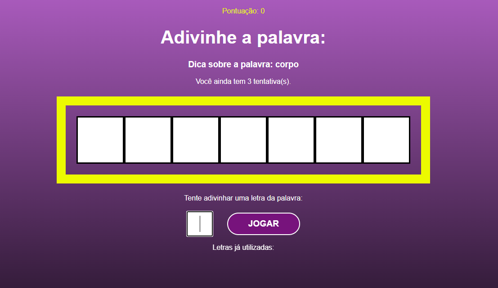

<h1 align="center">
    Secret Word
</h1>
<h1 align="center">
  
</h1>

<h3 align="center">
    <a href="https://secret-word-jufml.netlify.app/">Access demo page</a>
<h3 >

# Index

- [About](#-about)
- [Technologies used](#-technologies-used)
- [How to install and run the project](#-how-to-install-and-run-the-project)

## 🔖&nbsp; About

This project is an application where the user must guess the secret word by typing letter by letter until the word is guessed. He can only miss 3 times.

---

## 🚀 Technologies used

The project was developed using the following technologies

- Semantic HTML5 markup
- CSS module
- JavaScript
- React
- VS Code

---

## 🗂 How to install and run the project

    - Clone the repository
    - Enter in the directory
    - Install dependencies - run 'npm install'
    
    If you want to run project in dev mode
    - Start project - run 'npm start'
    - Open http://localhost:3000 to view it in your browser.
    
    If you want to build project
    - Build project - run 'npm run build'
    - Your app is ready to be deployed!
   
---

Developed ❤ by Juliana Fernandez